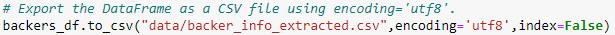
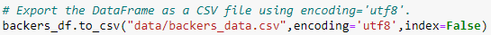

# Independent Funding Crowdfunding - Extract, Transform, Load (ETL)

## Overview of Independent Funding
In this module, we were working with Britta, a junior SQL developer for Independent Funding, which is a crowdfunding platform for funding independent projects or ventures. They previously retained all of their data in one large Excel file, but they have been growing and need to move their data into a PostgreSQL database in order to perform analysis and create reports for company stakeholders and individual donors. Throughout the module, we extracted and transformed the data from the large Excel file into four separate .csv files, created a PostgreSQL database and tables using an ERD, loaded the CSV files into the database, and performed SQL queries to generate reports for stakeholders.

The initial large Excel file ([crowdfunding.xlsx](data/crowdfunding.xlsx)) contained two worksheets, `crowdfunding_info`, and `contact_info`, which contained the following columns of data:

### `crowdfunding_info`
- cf_id
- company_name
- blurb
- goal
- pledged
- outcome
- backers_count
- country
- currency
- launched_at
- deadline
- staff_pick
- spotlight
- category & subcategory

### `contact_info`
- contact_id
- name
- email

After the ETL process, four .csv files were created ([campaign.csv](data/campaign.csv), [category.csv](data/category.csv), [subcategory.csv](data/subcategory.csv), and [contacts.csv](data/contacts.csv)) which were linked together with the following ERD:

The schema text used to generate this ERD on [QuickDBD](https://www.quickdatabasediagrams.com/) can be found in [QuickDBD_Schema_original.txt](resources/QuickDBD_Schema_original.txt).

In this Challenge assignment, Independent Funding has received a new dataset that contains information about the backers who have pledged to the live projects. The company wants us to perform ETL on the new dataset and tie it into the existing ERD. Once this is done, they have two tasks they want to be able to complete: (1) send an email to each contact of every live campaign to inform them of how much of the goal remains, and (2) to send an email to each backer to let them know how much of the goal remains for each live campaign they have pledged to.

These tasks are divided into the four deliverables shown below (from the Module Challenge webpage), along with substasks for each deliverable which we will walk through further down. The text for each deliverable is taken from the starter files. Below each subtask is an image of the Python or SQL script necessary to complete it. All Python script used in this Challenge can be found in [Extract-Transform_final_code.ipynb](Extract-Transform_final_code.ipynb), and SQL queries used in this Challenge can be found in [crowdfunding_SQL_Analysis.sql](queries/crowdfunding_SQL_Analysis.sql).

- **Deliverable 1: Extract Data**. Use Python, Pandas, and the extract and transform phases of ETL to extract the raw data and add it to a DataFrame for the transform phase.
- **Deliverable 2: Transform and Clean Data**. Use Python, Pandas, and data cleaning strategies to transform the data via formatting, splitting, converting data types, and restructuring to create a DataFrame that can be loaded into a postgreSQL database as a .csv file.
- **Deliverable 3: Create an ERD and a Table Schema and Load the Data**. Update the ERD previously created in this Module with a new backers table. Export the updated database schema to PostgreSQL and add the backers table to the database. Then import the .csv file from Deliverable 2 into the backers table.
- **Deliverable 4: SQL Analysis**. Write SQL queries to retrieve the number of backers for each live campaign, compile an email list of contacts for every live campaign with how much of their goal remains, and compile an email list of all current backers of live campaigns along with how much of the goal remains.

## Resources
- Software: Python 3.7.7, Conda 22.11.0, Jupyter Notebook 5.7.10, pgAdmin4 6.15 with PostgreSQL 14, [QuickDBD](https://www.quickdatabasediagrams.com/)

## Deliverable 1: Extract Data

### Option 1: Use Python Dictionary Methods

1. Import the backer_info.csv file into a DataFrame.

    

2. & 3. Iterate through the DataFrame and convert each row to a dictionary. Iterate through each dictionary and do the following: (a) Extract the dictionary values from the keys using Python list comprehension. (b) Add the values for each row to a new list.

    

4. Create a new DataFrame with the retrieved data.

    

5. Export the DataFrame as [backers_data.csv](data/backers_data.csv).

    

### Option 2: Use RegEx

1. Import the backer_info.csv file into a DataFrame.

    

2. Extract the "backer_id", "cf_id", "name", and "email using regular expressions."

    
    
    
    

3. Create a new DataFrame with the retrieved data.

    

4. Export the DataFrame as [backers_data.csv](data/backers_data.csv).

    

## Deliverable 2: Transform and Clean Data

1. Check the data types of the columns and convert the "cf_id" column to an integer, if necessary.

    

    

2. Split the name in the "name" column into first and last names, and add them to "first_name" and "last_name" columns in the DataFrame.

    

3. Drop the "name" column in the DataFrame.

    

4. Place the columns in the following order; "backer_id", "cf_id", "first_name", "last_name" and "email".

    

5. Export the DataFrame as [backers.csv](data/backers.csv).

    

## Deliverable 3: Create an ERD and a Table Schema and Load the Data

1. Use the information from the backers.csv file to update the ERD with a new backers table. The schema text used to generate this updated ERD on [QuickDBD](https://www.quickdatabasediagrams.com/) can be found in [QuickDBD_Schema_updated.txt](resources/QuickDBD_Schema_updated.txt).

    

2. After exporting this schema ([crowdfunding_db_schema.sql](queries/crowdfunding_db_schema.sql)) from [QuickDBD](https://www.quickdatabasediagrams.com/), the following queries were performed in PostgreSQL to add a `backers` table to the database. Then, the [backers.csv](data/backers.csv) file was imported into this table.

    

    

## Deliverable 4: SQL Analysis

1. Write a SQL query that retrieves the number of `backer_counts` in descending order for each "cf_id" for all the "live" campaigns.

    

2. Write a SQL query that uses the `backers` table to confirm the results from Step 2.

    

3. Write a SQL query that creates a new table named `email_contacts_remaining_goal_amount` that contains the first name of each contact, the last name, the email address, and the remaining goal amount (as "Remaining Goal Amount") in descending order for each live campaign. Export the table as [email_contacts_remaining_goal_amount.csv](data/email_contacts_remaining_goal_amount.csv).

    

4. Write a SQL query that creates a new table named `email_backers_remaining_goal_amount` that contains the email addresses of the backers in descending order, the first and the last name of each backer, the cf_id, the company name, the description, the end date of the campaign, and the remaining amount of the campaign goal as "Left of Goal". Export the table as [email_backers_remaining_goal_amount.csv](data/email_backers_remaining_goal_amount.csv).

    